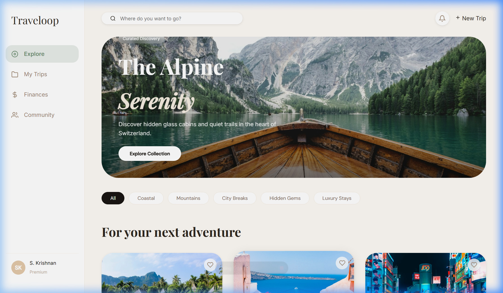
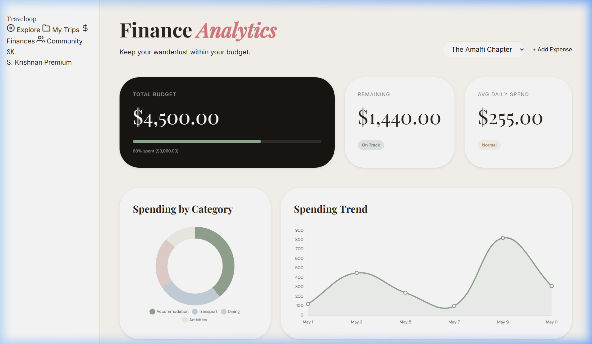
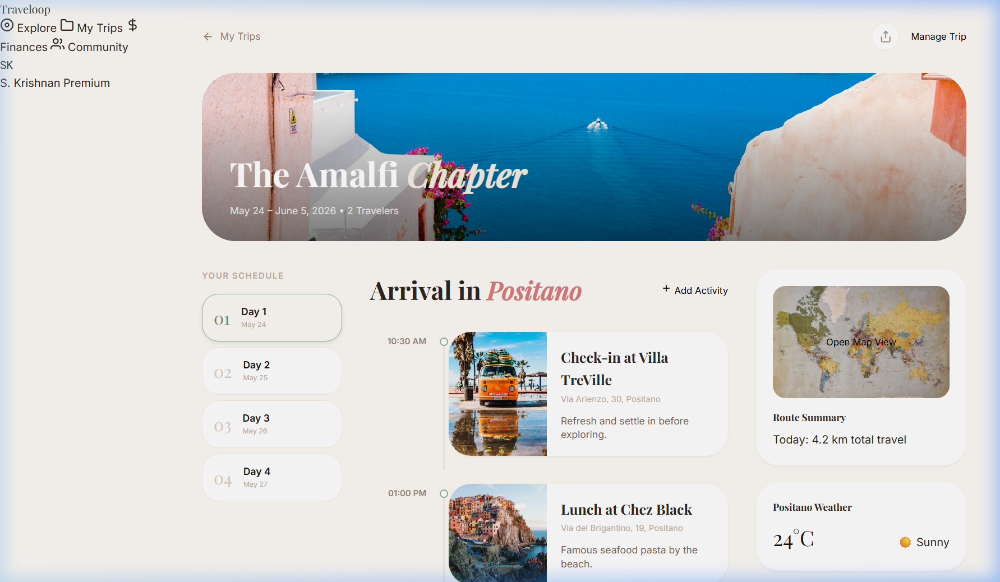

# Traveloop: End-to-End Travel Management Platform

Traveloop is a comprehensive, client-side travel orchestration platform designed for seamless journey planning, financial tracking, and collaborative trip management. The application is built using a modern vanilla frontend stack, prioritizing performance, maintainability, and a robust design system.

---

## 🛠 Application Architecture

The platform follows a modular architecture where each functional domain is encapsulated within dedicated HTML views, supported by a centralized CSS token system and independent JavaScript controllers.

### 1. Core Modules
- **Discovery Engine**: Interface for exploring destinations with category filtering and interactive preview components.
- **Journey Orchestrator**: A comprehensive day-by-day itinerary management system with contextual weather and location integration.
- **Financial Controller**: Real-time expense management hub featuring data visualization via Chart.js for spend analysis.
- **Collaborative Hub**: Permission-based sharing system allowing for multi-user coordination through link generation and email invitation workflows.
- **Resource Management**: Dynamic packing assistant and vision board modules for logistical and creative trip preparation.

---

## 🖼 Interface Gallery

| Destination Discovery | Financial Dashboard | Journey Itinerary |
| :--- | :--- | :--- |
|  |  |  |

---

### 2. Design System (tokens.css)
The application utilizes a CSS variable-driven design system that standardizes:
- **Spacing Scale**: A mathematical grid system for consistent layout padding and margins.
- **Typography Hierarchy**: Standardized font scales and weights for improved readability.
- **Color Palette**: A controlled set of semantic color tokens for surface, ink, and interactive states.
- **Component Primitives**: Global styles for buttons, inputs, cards, and the primary application sidebar.

---

## 📂 Technical Structure

### Directory Tree
```text
/TravelLoop
├── /assets              # Project-specific static assets and documentation screenshots
├── /scripts             # JavaScript Logic
│   ├── discovery.js     # Destination discovery logic and event handling
│   ├── budget.js        # Financial calculations and Chart.js integration
│   ├── packing-list.js  # Progress tracking and state management for checklists
│   └── ...              # Module-specific controllers (14 total)
├── /styles              # Styling System
│   ├── tokens.css       # Global design system and UI variables
│   ├── discovery.css    # Screen-specific layout modules
│   └── ...              # Component-specific styles
├── /*.html              # Main application views (Discovery, Itinerary, Budget, etc.)
└── README.md            # Technical documentation
```

### State Management
Interactivity is handled through screen-specific JavaScript modules that manage local state, DOM updates, and simulated asynchronous operations (e.g., toast notifications, progress bar transitions).

---

## 🚀 Deployment & Local Setup

### Prerequisites
- Any modern web browser (Chrome, Firefox, Safari, Edge).
- A local HTTP server for optimal resource loading.

### Initialization
1. Clone the repository:
   ```bash
   git clone https://github.com/Revanth126/OdooXkahe.git
   ```
2. Navigate to the project directory:
   ```bash
   cd TravelLoop
   ```
3. Start a local server:
   ```bash
   # Using Python
   python -m http.server 8000
   
   # Using Node.js (npx)
   npx serve .
   ```
4. Access the application via `http://localhost:8000/discovery.html`.

---

## 📈 Technical Roadmap
- **Persistence Layer**: Implementation of `localStorage` or a database integration for data persistence.
- **Authentication Services**: Backend integration for secure user sessions and profile management.
- **API Integration**: Real-time weather and flight data fetching via external REST APIs.
- **PWA Capabilities**: Adding manifest and service workers for offline journey access.

---

*Project maintained by the Traveloop Development Team.*
