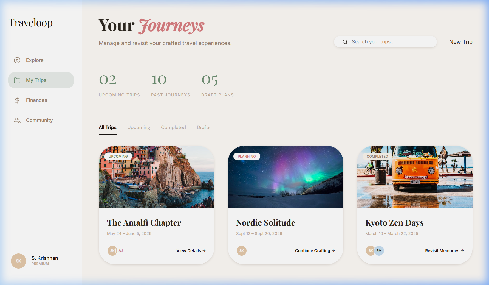

# 🗺️ Traveloop — Premium Travel Planning Ecosystem

**Traveloop** is a high-fidelity, luxury travel planning platform designed with an editorial, magazine-inspired aesthetic. Built using pure **Vanilla HTML, CSS, and JavaScript**, it prioritizes a sophisticated user experience, cinematic visuals, and seamless journey orchestration.



---

## ✦ Core Philosophy
Traveloop moves away from generic SaaS grids toward a **"Soft Pastel Summer"** aesthetic. Every screen is crafted to evoke the feeling of a travel journal—asymmetrical layouts, layered elements, and premium typography (Playfair Display & Inter).

## 🚀 Key Features

### 1. Cinematic Discovery
Explore the world through a wide-angle lens. High-impact hero banners and curated destination cards with glassmorphism overlays make exploration feel like browsing a luxury travel magazine.

### 2. Intelligent Itinerary
A vertical, day-by-day timeline that syncs with your trip's vibe. Includes contextual widgets for local weather, interactive maps, and "Add Activity" logic.

### 3. Finance Hub
Real-time expense tracking with high-contrast summary cards. Integrated analytics (Chart.js) provide a visual breakdown of your travel investment.

### 4. Collaborative Hub
Invite co-planners to "The Collective". Share private links, send email invitations, and manage roles to co-craft the perfect journey.

### 5. Smart Assistant & Packing
AI-driven packing suggestions based on destination weather, paired with a satisfying category-based progress tracking system.

---

## 🛠️ Technology Stack
- **Core:** HTML5, Vanilla CSS3, Modern JavaScript (ES6+)
- **Typography:** Google Fonts (Playfair Display, Inter, DM Sans)
- **Visuals:** Custom-generated luxury assets, Unsplash high-res photography
- **Analytics:** Chart.js for financial data visualization
- **Architecture:** Modular JS controllers per screen for lightweight state management

## 📂 Project Structure
```text
/assets          # Cinematic screenshots and images
/styles          # Central tokens.css and screen-specific modules
/scripts         # Vanilla JS controllers for interactivity
/discovery.html  # Main exploration hub
/itinerary.html  # Journey timeline
/budget.html     # Finance dashboard
...              # 14 high-fidelity screens in total
```

## 📸 Gallery

| Discovery | Itinerary | Finance |
| :--- | :--- | :--- |
|  |  |  |

---

## 🧑‍💻 Getting Started
1. Clone the repository.
2. Open `index.html` in any modern browser.
3. For the full experience, use a local server:
   ```bash
   npx serve .
   ```

---

*Crafted with ✦ by the Traveloop Team.*
